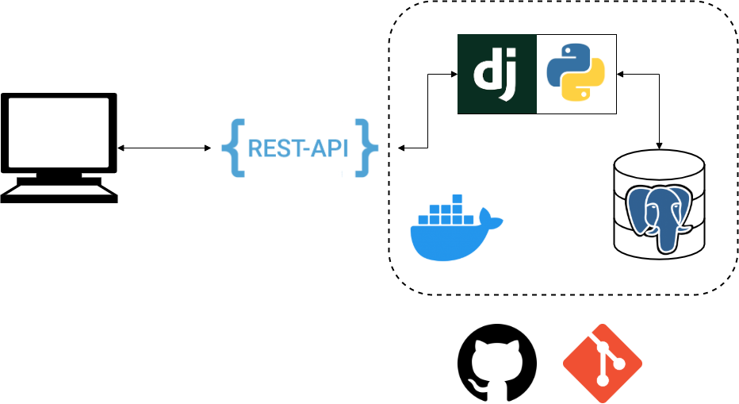

# Online Store

## Auth

В данной ветке представлено решение ДЗ 4, а именно:
* доступна регистрация пользователей по e-mail и паролю
* реализована авторизация по тем же данным (за счёт `JWT`)
* доступен механизм обмена `refresh token` на пару новых `(refresh, access)`
* есть возможность верифицировать `token` (является ли он валидным или нет)
* ограничен доступ к редактированию товаров

## Deploying with Docker-Compose
```bash
docker-compose up
```

## Architecture (from previous HW)


## API

У сервиса появилось несколько новых методов:
1. `PUT /api/register_user` принимает JSON с полями `email` и `password`, 
после чего возвращает сообщение о том, удалось ли добавить нового пользователя с такой почтой
2. `POST /api/authorize_user` принимает такой же JSON, 
а после успешной авторизации возвращает пару `(refresh, access) tokens`
3. `POST /api/refresh_token` ожидает JSON с полем `refresh`, где должен находиться `refresh token`, 
после чего возвращает новую пару `(refresh, access) tokens` (старый `refresh token` становится недействительным)
4. `GET /api/verify_token` принимает JSON с полем `token` и сообщает, является ли этот `token` действительным

Также, сервис изменил логику в отношении запросов к товарам: чтение (`GET` запросы) можно совершать без ограничений,
однако любое изменение данных (`PUT, POST, DELETE` запросы) требуют авторизации при помощи `access token`.


## Postman Schema 

К решению приложена коллекция для Postman, в которой сохранены примеры запросов API (как прошлых ДЗ, так и нового).
К любому запросу, требующему авторизацю, нужно:
1. открыть вкладку `Authorization`
2. выбрать `Type: Bearer Token`
3. вставить `access token` (который даётся при авторизации) в поле `Token` справа 
